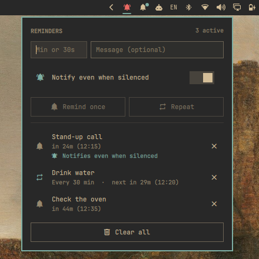

# Repeating Reminders

Desktop notification reminders in the Omarchy bar. They work like the built-in
`omarchy reminder`, with three differences:

- **They can repeat**: every half hour, drink some water.
- **They keep their time.** Each reminder is set to a time on the clock, not to
  a countdown, so a package update, sleep or a reboot does not move it.
- **They stay quiet while notifications are silenced**, unless you say
  otherwise for that reminder.



## Install

```bash
omarchy plugin add https://github.com/MaNi4/omarchy-repeating-reminders
```

Needs `jq`, `flock` (util-linux) and systemd user timers, all part of a stock
Omarchy install.

## Remove

Stop the reminders first, so no timer is left pointing at a script that is
gone, then remove the plugin:

```bash
~/.config/omarchy/plugins/mani4.repeating-reminders/bin/repeating-reminder clear
omarchy plugin remove mani4.repeating-reminders
rm -rf ~/.local/state/repeating-reminders
```

The plugin writes nothing outside its own folder and that state directory.

## Using it

- Click the bell for the panel. Type the minutes, Enter, type a message (or
  leave it empty), Enter, then pick **Remind once** or **Repeat every …**.
- Minutes can be a fraction (`0.5` or `0,5` is half a minute), or the time can
  be given in seconds (`30s`). Five seconds is the shortest.
- **Notify even when silenced** decides whether the reminder you are about to
  set shows while "Silence notifications" is on. It is off to begin with, and
  the panel remembers how you left it.
- The panel lists what is set, with the time left. A reminder that will show
  even when silenced says so in the accent colour, so you can tell what might
  pop up during a presentation. The cross stops a reminder, **Clear all**
  stops every one.
- Keyboard: Enter walks from field to field, Tab switches between them, up/down
  move, Enter or `x` on a reminder stops it, Esc empties a field or closes.
- The bell rings in the bar while a reminder is set.

## What happens when

| | |
|---|---|
| A package is installed or updated | Nothing; the reminder comes at its time. |
| The machine sleeps past the time | The reminder comes when it wakes. |
| Reboot or logout | Reminders are set again for the time they were due. |
| A one-off came due while the machine was off | It is forgotten. |
| A repeating one came due while the machine was off | The missed times are skipped; it carries on in its old rhythm. |
| Notifications are silenced | A quiet reminder is held back and can be read in the notification history. |

## Command line

```bash
bin/repeating-reminder add 30 "Check the oven"        # once, in 30 minutes
bin/repeating-reminder add --loop 30 "Drink water"    # every 30 minutes
bin/repeating-reminder add --loop 90s "Stretch"       # every 90 seconds
bin/repeating-reminder add --loud 30 "Call back"      # shows even while notifications are silenced
bin/repeating-reminder list                           # JSON
bin/repeating-reminder stop <unit>
bin/repeating-reminder clear
```

Open the panel from a keybinding with
`omarchy-shell -q mani4.repeating-reminders toggle`.

## How it works

Every firing is a transient systemd user timer named `repeating-reminder-*`,
kept apart from the built-in `omarchy-reminder-*` ones and set with
`OnCalendar=` to the exact time. A repeating reminder sets its next timer when
it fires. What is set is kept in `~/.local/state/repeating-reminders/`, one
small JSON file per reminder, which is how the panel puts the timers back
after a reboot.

The bar exists once per monitor, so the list and the commands live in a shell
service (`Service.qml`) and each monitor's panel only shows it.

A loud reminder gets through "Silence notifications" by being sent the way
Omarchy's own action toasts are, which Omarchy lets through on purpose. That
is Omarchy's behaviour, not a documented interface: if it changes, loud
reminders would be held back like the quiet ones.

## License

MIT
